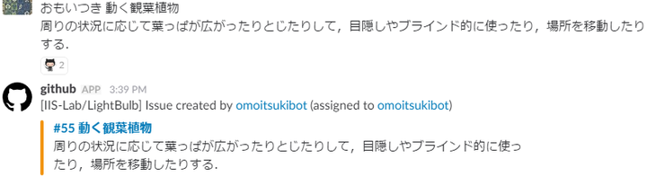
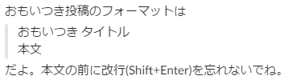

# Omoitsuki-bot

A slack bot that post your omoitsuki to GitHub

## Description

*Omotsuki-bot* is a slack bot that automatically post your *omoitsuki* to a designated GitHub repository as an Issue.  
It also tracks slack thread comments to *omoitsuki* post, and add comments to the corresponding GitHub Issue as well.
  

## Features

- Simply post your *omoitsuki* to slack, *anytime* / *anywhere*.
- Automated posting of your *omoitsuki* and comments to your GitHub.
- *Omoitsuki* stocked in your GitHub waiting to be refereed by you !

## Requirement

- Python3 or more
	- requests(2.12.4)
	- slackbot(0.4.1)

## <a name="Usage"> Usage

First, [Deploy](#deploy) your *omoitsukibot* app.  

Now, you can stock your *omoitsuki* by posting messages to the Slack channel you invited your bot to.
1. Send your *omoitsuki* to your slack channel according to the format below.
> *omoitsukibot* will post your *omoitsuki* to your GitHub repository as an Issue.

(This feature is still under delevlopment)
2. Make comments to *omoitsuki*. There are two ways.
  - post `#[Issue No.][your comment]`
  - create a thread to a posted *omoistuki* and make your comment there
> *omoitsukibot* will post your comment to the corresponding GitHub Issue.

## <a name="Deploy"> Installation & Deploy(local)
### 1. Download
    $ git clone https://github.com/attache-case/omoitsukibot
### <a name="CreateYourSlackBot">2. Create your slack bot
You can set your bot name as you like.  
Please note the `API Token` of your slack bot.  
You will use this in the next step.
### 3. Set Environment Valuables
KEY | VALUE
:---|:---
SLACK_API_TOKEN   | {{API Token of your slack bot}}
GITHUB_USERNAME   | {{username of the GitHub account that execute posting}} *planning to remove
GITHUB_PASSWORD   | {{password of the GitHub account that execute posting}} *planning to remove
GITHUB_TOKEN      | {{GitHub personal access token with 'read/write' permissions to your repository}}
GITHUB_REPO_OWNER | {{owner of the GitHub repository where the bot will post}}
GITHUB_REPO_NAME  | {{name of the GitHub repository where the bot will post}}

Please customize these environment valuables according to your GitHub account information.  
Also, use your slack bot's API token you created in [2.](#CreateYourSlackBot) and create token for github access, too.
### 4. Run your bot
    $ cd /omoitsukibot
    $ python run.py
### 5. Invite your bot to your slack channel
type

> /invite @omoitsukibot

and send in your channel(`@omoitsukibot` is the name of the bot you set in [2.](#CreateYourSlackBot))
### 6. Post your *omoitsuki* !
See [Usage](#Usage).

## Author

[@attache-case](https://twitter.com/tache_case)
